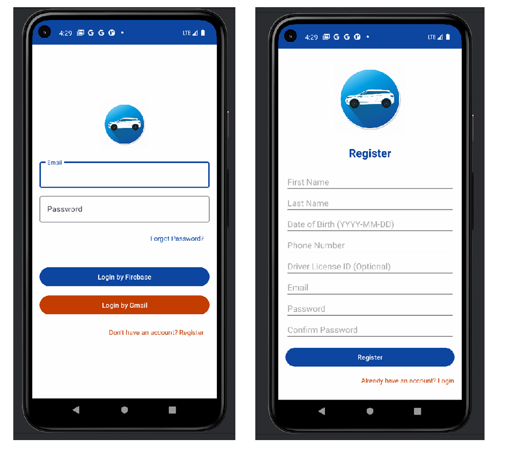
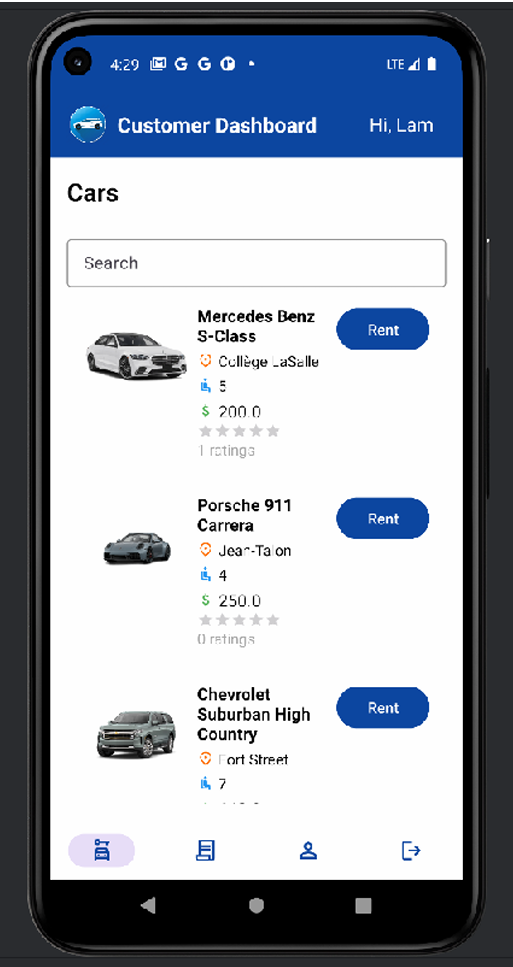
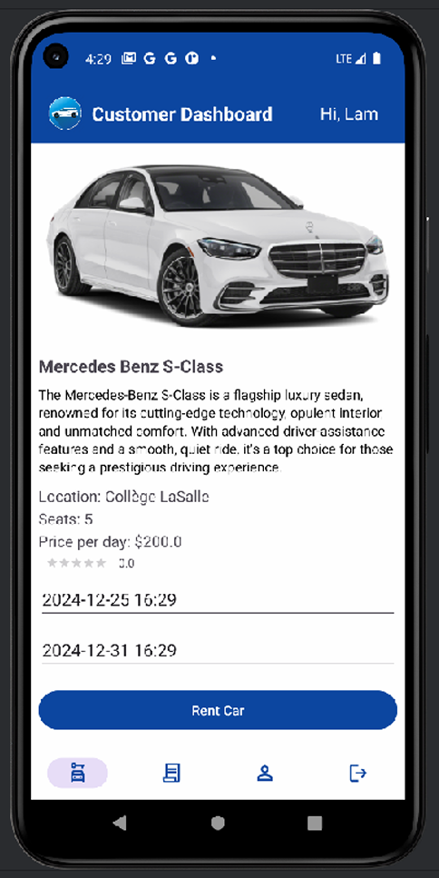
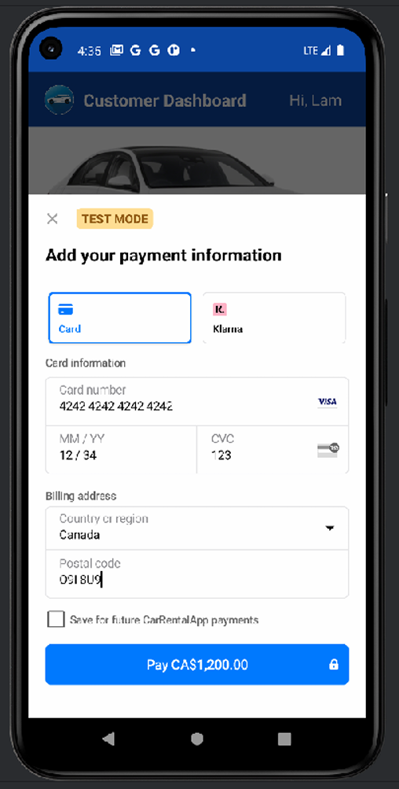
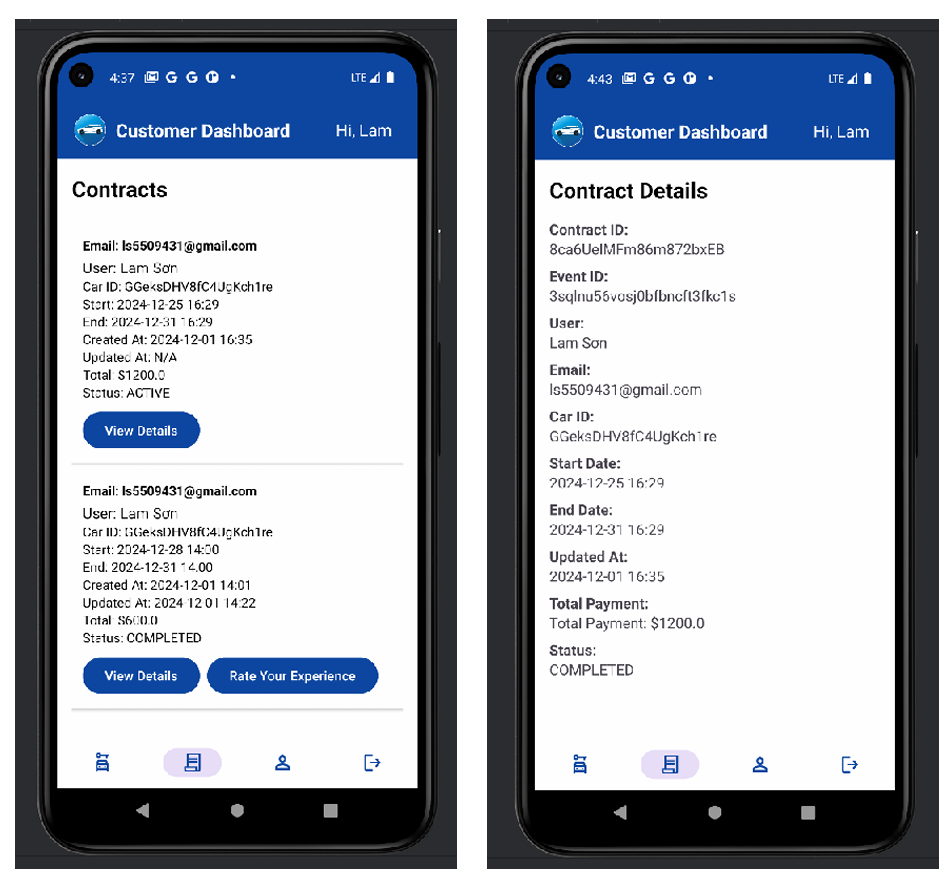
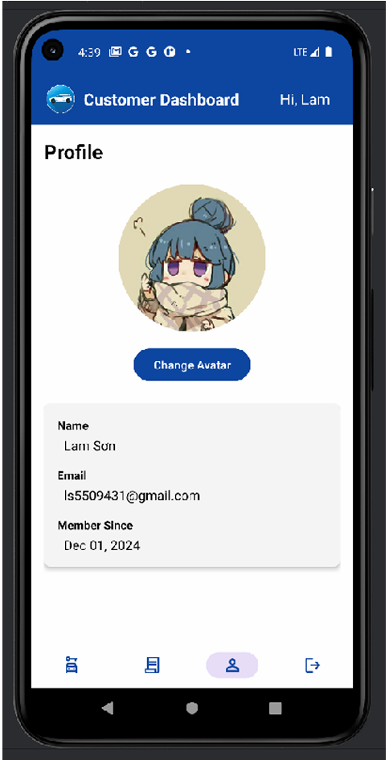
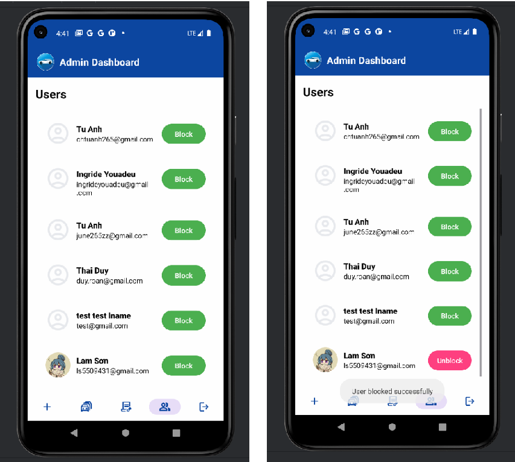
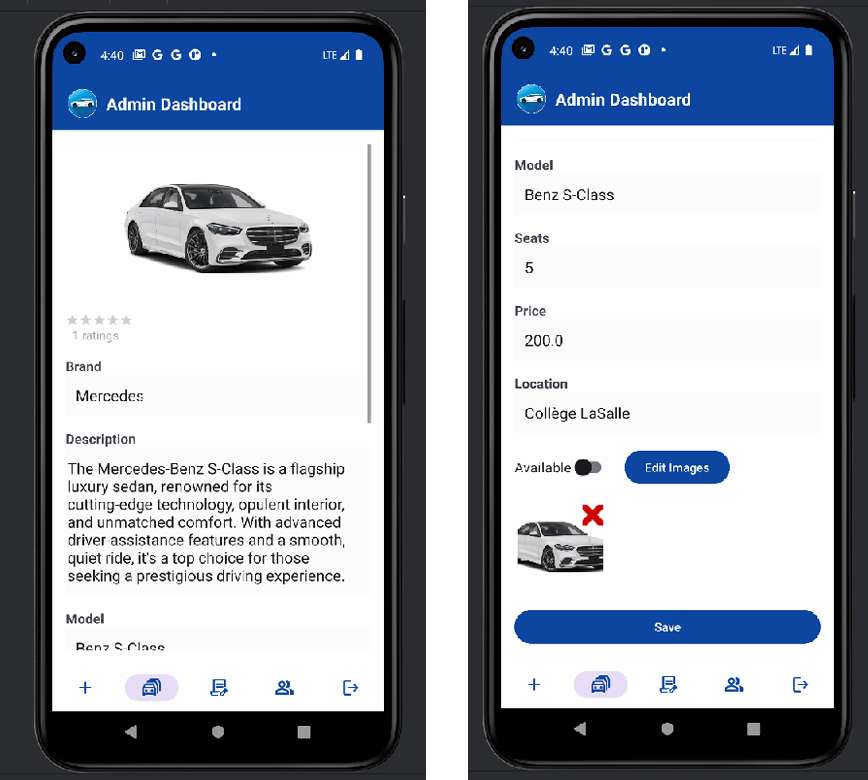
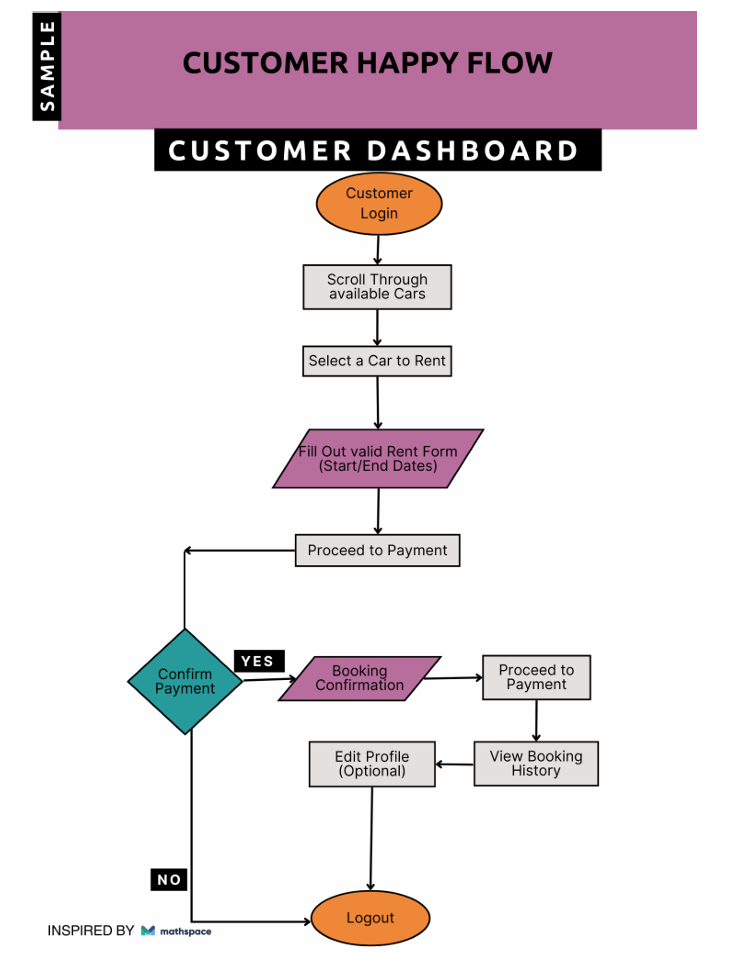

# Car Rental Management App

This repository contains the **Car Rental Management App**, a comprehensive Android application developed to streamline operations in the car rental industry for both customers and administrators.

---

## 📖 About

The **Car Rental Management App** is designed to simplify car rental processes through features like user authentication, car management, rental bookings, and secure payment processing. Built using modern tools and technologies, the app provides a seamless experience for both customers and administrators.

---

# 🚫 Project Status: Closed

This project scored **76.67%** during evaluation.
This project is no longer under active development. **Please download and experience it yourself.** Consider it as a **reference project** for learning and inspiration. Contributions or updates will not be made.

---

## 📝 Key Features

### **Customer's Side**

- **User Authentication**: Secure login and registration using Firebase Authentication.
- **Car Search and Details**: Browse and search for cars based on brand, model, pricing, and availability.
- **Car Rental Process**: Book cars for specific rental periods.
- **Payment Options**: Make secure payments using Stripe API.
- **Post-Rental Management**: View rental contracts and manage personal account details.

### **Admin's Side**

- **Car Management**: Add, edit, view, and update car details.
- **Contract Oversight**: Manage and update customer rental contracts.
- **User Management**: View and block user accounts.

---

## 💻 Technologies Used

- **Frontend**: XML (UI design), Java (business logic), Gradle (build automation).
- **Backend**:
  - Firebase Authentication for user login.
  - Firebase Storage for managing car images.
  - APIs: Stripe for payments, Google Location, and Google Calendar for bookings.
- **Tools**: Android Studio, Firebase Console, GitHub.

---

## 📸 Screenshots

### Customer's Side

#### Login and Registration

#### Dashboard

#### Rent a Car

#### Payment

#### Contracts

#### Profile

---

### Admin's Side

#### Dashboard

#### Edit Car Details

#### Manage Contracts

---

## 📂 Folder Structure

- **`imgs/`**: Contains all screenshots and images.
- **`app/`**: Android application source code.
- **`node_modules/`**: Dependencies for Stripe API and other backend integrations.
- **`.env`**: Environment variables for API keys.
- **`server.js`**: Node.js server file for Stripe API.
